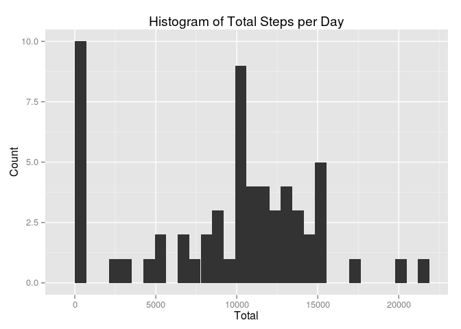
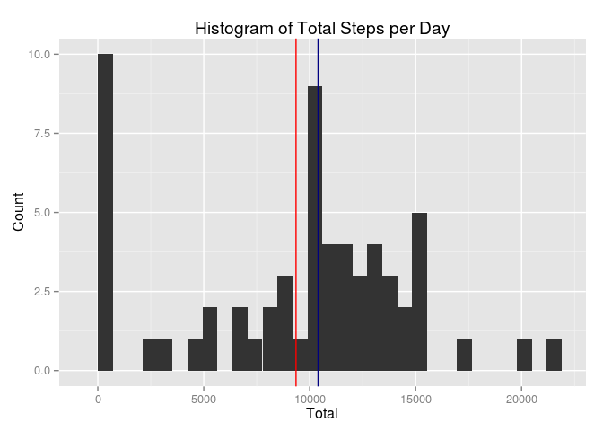
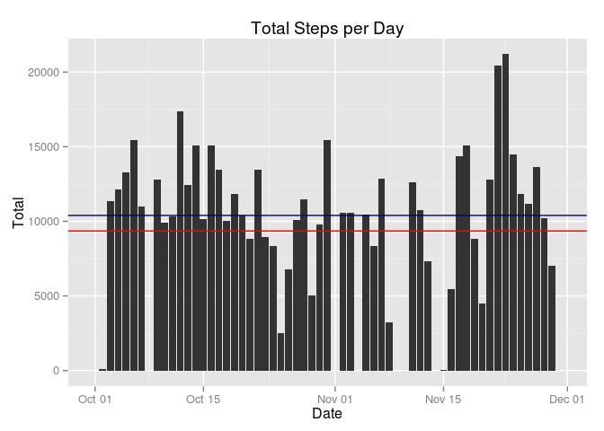
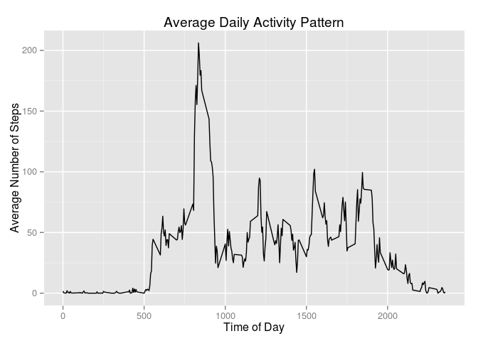
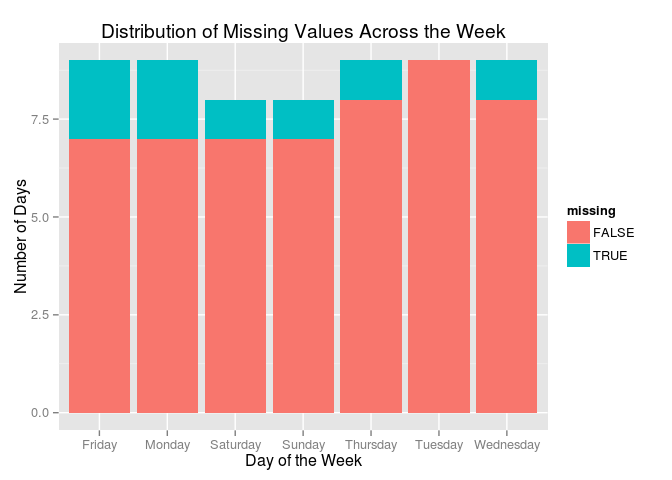
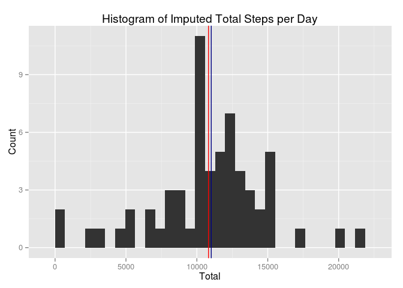
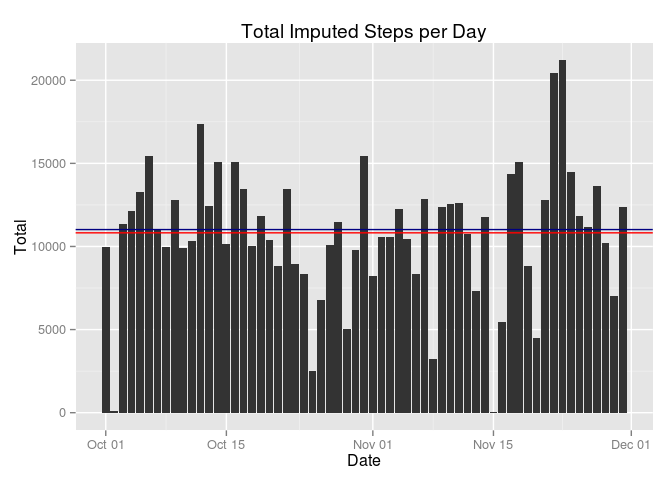
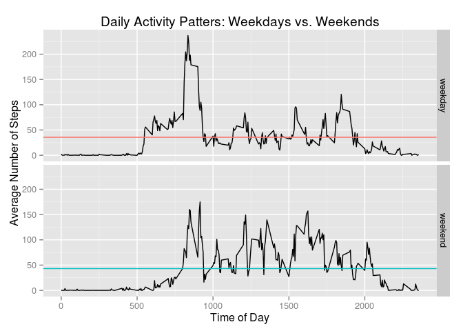

# Exploring Activity Monitor Data

Using data from a personal activity monitoring device, we're going to answer four questions:
1. What is the mean total number of steps taken per day?
2. What is the average daily activity pattern?
3. How does imputing missing values affect the data?
4. Are there differences in activity patterns between weekdays and weekends?  

Let's get started!

## Loading and preprocessing the data

If you don't have the data, you can find it [here](https://github.com/mattayes/RepData_PeerAssessment1/blob/master/activity.zip?raw=true).

Let's start by reading our data in. I'll be using the dplyr package later, so I'll add a `tbl_df` wrapper now.


```r
library(dplyr)
```

```
## 
## Attaching package: 'dplyr'
## 
## The following object is masked from 'package:stats':
## 
##     filter
## 
## The following objects are masked from 'package:base':
## 
##     intersect, setdiff, setequal, union
```

```r
activity <- tbl_df(read.csv("./activity.csv",
                            stringsAsFactors = FALSE,
                            colClasses = c("integer", "Date", "integer")
                            )
                   )
```

Let's take a quick peek at our data to see what we're working with.


```r
activity
```

```
## Source: local data frame [17,568 x 3]
## 
##    steps       date interval
## 1     NA 2012-10-01        0
## 2     NA 2012-10-01        5
## 3     NA 2012-10-01       10
## 4     NA 2012-10-01       15
## 5     NA 2012-10-01       20
## 6     NA 2012-10-01       25
## 7     NA 2012-10-01       30
## 8     NA 2012-10-01       35
## 9     NA 2012-10-01       40
## 10    NA 2012-10-01       45
## ..   ...        ...      ...
```

We can see that there are three variables:

- **steps**: number of steps taken in a five-minute interval (missing values are coded as `NA`)

- **date**: the date on which the measurement was taken

- **interval**: identifier for the five-minute interval in which the measurement was taken

Aesthetics REALLY matters to me, so I'm going to make steps the last variable.


```r
activity <- activity %>%
    select(date, interval, steps)
activity
```

```
## Source: local data frame [17,568 x 3]
## 
##          date interval steps
## 1  2012-10-01        0    NA
## 2  2012-10-01        5    NA
## 3  2012-10-01       10    NA
## 4  2012-10-01       15    NA
## 5  2012-10-01       20    NA
## 6  2012-10-01       25    NA
## 7  2012-10-01       30    NA
## 8  2012-10-01       35    NA
## 9  2012-10-01       40    NA
## 10 2012-10-01       45    NA
## ..        ...      ...   ...
```

With the pre-processing out of the way, let's do some analysis!

## What is mean total number of steps taken per day?

To get a sense of how activity levels change over time, let's find the total number of steps they take each day.


```r
library(ggplot2)
mtotal <- activity %>%
    group_by(date) %>%
    summarize(total = sum(steps, na.rm = TRUE))
mtplot <- ggplot(mtotal, aes(total)) + geom_histogram() +
    labs(x = "Total", y = "Count", title = "Histogram of Total Steps per Day")
mtplot
```

```
## stat_bin: binwidth defaulted to range/30. Use 'binwidth = x' to adjust this.
```

 

A few points

- There seems to be quite a few days with close to zero steps. Missing values, perhaps?

- Aside from the near-zeros, the data appear to be normally distributed.

Adding the mean and median values should give us a better picture.


```r
meant <- mean(mtotal$total)
medt <- median(mtotal$total)
meant
```

```
## [1] 9354.23
```

```r
medt
```

```
## [1] 10395
```

```r
mtplot2 <- mtplot + geom_vline(xintercept = meant, col = "red") + 
    geom_vline(xintercept = medt, col = "navy")
mtplot2
```

```
## stat_bin: binwidth defaulted to range/30. Use 'binwidth = x' to adjust this.
```

 

Same story: Mean < median, therefore skewed.

Just for fun, let's plot this over time.


```r
mtplot3 <- ggplot(mtotal, aes(date, total)) + 
    geom_histogram(stat = "identity") +
    geom_hline(yintercept = meant, col = "red") +
    geom_hline(yintercept = medt, col = "navy") +
    labs(x = "Date", y = "Total", title = "Total Steps per Day")
mtplot3
```

 

## What is the average daily activity pattern?

Now that we know how activity varies over the period, let's see how it varies over the course of the average day.


```r
avg <- activity %>%
    group_by(interval) %>%
    summarize(mean = mean(steps, na.rm = TRUE))
avgplot <- ggplot(avg, aes(interval, mean)) + geom_line() +
    labs(x = "Time of Day", y = "Average Number of Steps") +
    ggtitle("Average Daily Activity Pattern")
avgplot
```

 

That's quite a spike in the morning! Jogger, perhaps? What are the most-active intervals?


```r
avgmax <- arrange(avg, desc(mean))
avgmax
```

```
## Source: local data frame [288 x 2]
## 
##    interval     mean
## 1       835 206.1698
## 2       840 195.9245
## 3       850 183.3962
## 4       845 179.5660
## 5       830 177.3019
## 6       820 171.1509
## 7       855 167.0189
## 8       815 157.5283
## 9       825 155.3962
## 10      900 143.4528
## ..      ...      ...
```

Definitely a jogger. For added effect, let's make a cascading bar plot.


```r
with(avgmax, barplot(mean, col = "black", ylab = "Number of Steps"))
```

 

Beautiful.

## Imputing missing values

If you noticed the warning earlier, we had 8 rows containing missing values. How much missing data do we actually have?


```r
summarize(activity, missing = sum(is.na(steps)),
          prop = missing / n())
```

```
## Source: local data frame [1 x 2]
## 
##   missing      prop
## 1    2304 0.1311475
```

Approximately 13% of our data is missing. Not too far off from the one-sixth (17%) estimate above. How is this missing data distributed?


```r
misdist <- activity %>%
    group_by(date) %>%
    summarize(missing = any(is.na(steps)),
              all_missing = all(is.na(steps)))
with(misdist, identical(missing, all_missing))
```

```
## [1] TRUE
```

If a day has missing values, the entire day is missing. That means missing values aren't tied to particular intervals. But what about particular days of the week?


```r
ggplot(misdist, aes(weekdays(date))) + geom_histogram(aes(fill = missing)) +
    labs(x = "Day of the Week", y = "Number of Days") +
    ggtitle("Distribution of Missing Values Across the Week")
```

 

No pattern to be seen! This makes the next step a bit easier.

There's a few methods we can take to impute missing values.

1. Use the mean/median for each day;

2. Use the mean/median for each interval;

3. Use the mean/median for each day of the week.

The first method won't work for us, since missing values occur for entire days. Since activity might vary over the course of a week (more to come in the next section!), let's impute by the mean step for each corresponding interval and day of the week. We'll round because half-steps don't make sense.


```r
impute <- activity %>%
    mutate(weekday = weekdays(date)) %>%
    group_by(weekday, interval) %>%
    mutate(avg = round(mean(steps, na.rm = TRUE))) %>%
    ungroup() %>%
    mutate(steps = ifelse(is.na(steps), avg, steps)) %>%
    select(date, interval, steps)
impute
```

```
## Source: local data frame [17,568 x 3]
## 
##          date interval steps
## 1  2012-10-01        0     1
## 2  2012-10-01        5     0
## 3  2012-10-01       10     0
## 4  2012-10-01       15     0
## 5  2012-10-01       20     0
## 6  2012-10-01       25     5
## 7  2012-10-01       30     0
## 8  2012-10-01       35     0
## 9  2012-10-01       40     0
## 10 2012-10-01       45     0
## ..        ...      ...   ...
```

Missing values: 0! Let's recreate the statisics from the first section.


```r
imputetotal <- impute %>%
    group_by(date) %>%
    summarize(total = sum(steps))
```

How do the means and medians compare?


```r
meanim <- mean(imputetotal$total)
medim <- median(imputetotal$total)
c(meant, medt)
```

```
## [1]  9354.23 10395.00
```

```r
c(meanim, medim)
```

```
## [1] 10821.1 11015.0
```

The mean and median are now much closer together.

Now let's compare the histograms.


```r
imputeplot <- ggplot(imputetotal, aes(total)) + geom_histogram() +
    geom_vline(xintercept = meanim, col = "red") + 
    geom_vline(xintercept = medim, col = "navy") +
    labs(x = "Total", y = "Count") +
    ggtitle("Histogram of Imputed Total Steps per Day")
mtplot2
```

```
## stat_bin: binwidth defaulted to range/30. Use 'binwidth = x' to adjust this.
```

 

```r
imputeplot
```

```
## stat_bin: binwidth defaulted to range/30. Use 'binwidth = x' to adjust this.
```

 

And finally the bar plots.


```r
imputeplot2 <- ggplot(imputetotal, aes(date, total)) + 
    geom_histogram(stat = "identity") +
    geom_hline(yintercept = meanim, col = "red") +
    geom_hline(yintercept = medim, col = "navy") +
    labs(x = "Date", y = "Total", title = "Total Imputed Steps per Day")
mtplot3
```

 

```r
imputeplot2
```

 

## Are there differences in activity patterns between weekdays and weekends?

Anecdotally speaking, I move on lot less on weekends than I do on weekdays. Is this true for others?


```r
week <- impute %>%
    mutate(day = weekdays(date),
           group = ifelse(day %in% c("Saturday", "Sunday"), 
                          "weekend", "weekday"),
           group = factor(group)
           ) %>%
    group_by(interval, group) %>%
    summarize(steps = mean(steps))
week
```

```
## Source: local data frame [576 x 3]
## Groups: interval
## 
##    interval   group      steps
## 1         0 weekday 2.28888889
## 2         0 weekend 0.00000000
## 3         5 weekday 0.44444444
## 4         5 weekend 0.00000000
## 5        10 weekday 0.17777778
## 6        10 weekend 0.00000000
## 7        15 weekday 0.20000000
## 8        15 weekend 0.00000000
## 9        20 weekday 0.08888889
## 10       20 weekend 0.00000000
## ..      ...     ...        ...
```

How do the means compare?


```r
wmean <- week %>%
    ungroup() %>%
    group_by(group) %>%
    summarize(mean = mean(steps))
wmean
```

```
## Source: local data frame [2 x 2]
## 
##     group     mean
## 1 weekday 35.61651
## 2 weekend 43.07661
```

To the plots!


```r
weekplot <- ggplot(week, aes(interval, steps)) + 
    geom_line() + 
    facet_grid(group ~ .) + 
    geom_hline(data = wmean, aes(yintercept = mean, col = group)) +
    labs(x = "Time of Day", y = "Average Number of Steps") +
    ggtitle("Daily Activity Patters: Weekdays vs. Weekends")    
weekplot
```

 

You can use these graphs to make some guesses about this person's life:

- Either exercises or actively commutes in the morning
- Has a desk job (9-5)
- Passively commutes home
- Sleeps in when not going to work
- Likes to get around on the weekends

Creepy? Yes. Cool? You betcha!
